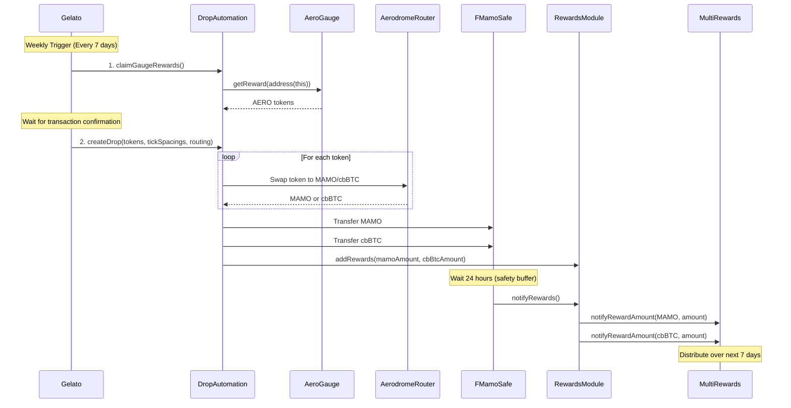

# Drop Automation Architecture

## Overview

The Drop Automation system automates weekly reward distributions for the F-MAMO staking program. It collects protocol fees from various sources (BurnAndEarn contracts), claims rewards from Aerodrome gauges, swaps collected tokens to MAMO and cbBTC, and distributes them to F-MAMO stakers through the RewardsDistributorSafeModule.

The system is designed with a clear separation of concerns:
- **Claiming**: Collect rewards from gauges without swapping
- **Swapping**: Convert collected tokens to MAMO/cbBTC with flexible routing
- **Distribution**: Forward rewards to the F-MAMO Safe for staker distribution

## Core Components

### DropAutomation Contract

The main contract responsible for:
- Claiming rewards from Aerodrome gauges
- Swapping collected tokens via Aerodrome
- Distributing MAMO/cbBTC to F-MAMO stakers

**Key Properties:**
- Owned by F-MAMO Safe (for governance)
- `dedicatedMsgSender`: Gelato automation address (only address that can trigger drops)
- Non-upgradeable design for security

### Revenue Sources

1. **BurnAndEarn Contracts** (fee collection)
   - BurnAndEarn (0xe25e010026692De7A3bb35ef7474cdf4fa1C7e44)
   - BurnAndEarn Virtual MAMO LP (0x79c1921Fc8CD076415cBD1EBB330629F4EC7Bbd1)
   - TransferAndEarn (0x95B0D21bBc973A6aEc501026260e26D333b94d80)
   - Tokens collected: MAMO, cbBTC, WETH, and various reward tokens

2. **Aerodrome Gauges** (liquidity mining rewards)
   - USDC-AERO Gauge (0x4F09bAb2f0E15e2A078A227FE1537665F55b8360)
   - Rewards claimed: AERO tokens

## Gelato Automation Flow

### Step 1: Claim Gauge Rewards

```solidity
function claimGaugeRewards() external onlyDedicatedMsgSender
```

**Purpose:** Claims AERO rewards from all configured Aerodrome gauges without swapping.

**Access Control:** Only `dedicatedMsgSender` (Gelato)

**What it does:**
1. Iterates through all configured gauges
2. Calls `gauge.getReward(address(this))` for each gauge
3. AERO tokens accumulate in the DropAutomation contract

**Important:** This function does NOT swap tokens. It only claims rewards.

### Step 2: Create Drop (Swap & Distribute)

```solidity
function createDrop(
    address[] calldata swapTokens_,
    int24[] calldata tickSpacings_,
    bool[] calldata swapDirectToCbBtc_
) external onlyDedicatedMsgSender
```

**Purpose:** Swaps all collected tokens to MAMO/cbBTC and distributes to F-MAMO Safe.

**Access Control:** Only `dedicatedMsgSender` (Gelato)

**Parameters:**

| Parameter | Type | Description |
|-----------|------|-------------|
| `swapTokens_` | `address[]` | Array of token addresses to swap |
| `tickSpacings_` | `int24[]` | Tick spacing for each token's pool (Aerodrome CL) |
| `swapDirectToCbBtc_` | `bool[]` | Routing flag: `true` = direct swap to cbBTC, `false` = swap through MAMO |

**Example Call:**

```solidity
address[] memory tokens = new address[](5);
tokens[0] = WETH;     // 0x4200000000000000000000000000000000000006
tokens[1] = ZORA;     // 0x1111111111166b7FE7bd91427724B487980aFc69
tokens[2] = EDGE;     // 0xED6E000dEF95780fb89734c07EE2ce9F6dcAf110
tokens[3] = VIRTUALS; // 0x0b3e328455c4059EEb9e3f84b5543F74E24e7E1b
tokens[4] = AERO;     // 0x940181a94A35A4569E4529A3CDfB74e38FD98631

int24[] memory tickSpacings = new int24[](5);
tickSpacings[0] = 200; // WETH/MAMO pool tick spacing
tickSpacings[1] = 200; // ZORA/MAMO pool tick spacing
tickSpacings[2] = 200; // EDGE/MAMO pool tick spacing
tickSpacings[3] = 200; // VIRTUALS/MAMO pool tick spacing
tickSpacings[4] = 200; // AERO/cbBTC pool tick spacing

bool[] memory swapDirectToCbBtc = new bool[](5);
swapDirectToCbBtc[0] = false; // WETH → MAMO → cbBTC
swapDirectToCbBtc[1] = false; // ZORA → MAMO → cbBTC
swapDirectToCbBtc[2] = false; // EDGE → MAMO → cbBTC
swapDirectToCbBtc[3] = false; // VIRTUALS → MAMO → cbBTC
swapDirectToCbBtc[4] = true;  // AERO → cbBTC (direct, no MAMO pool)

dropAutomation.createDrop(tokens, tickSpacings, swapDirectToCbBtc);
```

**Process:**
1. Swaps all provided tokens based on routing flags:
   - **Direct to cbBTC** (`swapDirectToCbBtc[i] = true`): Single swap (e.g., AERO → cbBTC)
   - **Through MAMO** (`swapDirectToCbBtc[i] = false`): Two-step swap (e.g., WETH → MAMO → cbBTC)
2. Transfers all MAMO balance to F-MAMO Safe
3. Transfers all cbBTC balance to F-MAMO Safe
4. Calls `SAFE_REWARDS_DISTRIBUTOR_MODULE.addRewards(mamoAmount, cbBtcAmount)` to stage rewards

## Swap Routing Logic

### Why Different Routing?

Not all tokens have direct liquidity pools with both MAMO and cbBTC. The routing system provides flexibility:

**Direct Swap to cbBTC:**
- Used when a token has a pool with cbBTC but NOT with MAMO
- Example: AERO token
- Route: `AERO → cbBTC` (single swap)

**Two-Step Swap Through MAMO:**
- Used when a token has a pool with MAMO
- Example: WETH, ZORA, EDGE, VIRTUALS
- Route: `Token → MAMO → cbBTC` (two swaps)

### Slippage Protection

**Max Slippage:** Configurable via `setMaxSlippageBps()`
- Default: 100 bps (1%)
- Maximum: 500 bps (5%)

**How it works:**
1. Get quote from Aerodrome Quoter
2. Calculate minimum output: `minOut = quote * (10000 - maxSlippageBps) / 10000`
3. Execute swap with `amountOutMinimum = minOut`
4. Revert if received amount < minimum

### Tick Spacing

Aerodrome Concentrated Liquidity pools use tick spacing to define price granularity:
- **200**: Standard for volatile asset pairs
- Other values may be used for stable pairs or custom configurations

## Weekly Automation Schedule



## Gauge Management

### Adding a Gauge

```solidity
function addGauge(address gauge_) external onlyOwner
```

**Requirements:**
- Gauge must be a valid contract
- Gauge must have valid `rewardToken()` and `stakingToken()`
- Gauge must not already be configured

**What happens:**
- Gauge is added to `aerodromeGauges` array
- `isConfiguredGauge[gauge]` set to true
- Emits `GaugeAdded(gauge)` event

### Removing a Gauge

```solidity
function removeGauge(address gauge_) external onlyOwner
```

**Use case:** Stop claiming rewards from a gauge (e.g., if LP position is withdrawn)

### Withdrawing from Gauge

```solidity
function withdrawGauge(
    address gauge_,
    uint256 amount,
    address recipient
) external onlyOwner
```

**Use case:** Emergency withdrawal or rebalancing LP positions

## Security Considerations

### Access Control

| Function | Access | Rationale |
|----------|--------|-----------|
| `claimGaugeRewards()` | `onlyDedicatedMsgSender` | Prevent DoS by limiting who can trigger claims |
| `createDrop()` | `onlyDedicatedMsgSender` | Prevent sandwich attacks by restricting swap execution |
| `addGauge()` | `onlyOwner` | F-MAMO multisig controls which gauges to claim from |
| `removeGauge()` | `onlyOwner` | F-MAMO multisig controls gauge configuration |
| `withdrawGauge()` | `onlyOwner` | F-MAMO multisig controls LP positions |
| `setDedicatedMsgSender()` | `onlyOwner` | F-MAMO multisig can update Gelato address |
| `setMaxSlippageBps()` | `onlyOwner` | F-MAMO multisig controls slippage tolerance |
| `recoverERC20()` | `onlyOwner` | F-MAMO multisig can recover stuck tokens |

### Why Separate Claim and Swap?

**Problem:** Combining claim and swap in a single public function creates a DoS attack vector:
- Attacker could repeatedly call the function
- Each call incurs swap fees and gas costs
- Rewards would be eaten by unnecessary swap fees

**Solution:** Two-step process with access control:
1. `claimGaugeRewards()`: Only claims rewards (restricted access)
2. `createDrop()`: Only swaps and distributes (restricted access)

This ensures:
- Gelato controls when swaps occur
- No DoS attacks from repeated calls
- Optimal fee efficiency

### Slippage Protection

**MEV Protection:**
- Swaps use Aerodrome Quoter for price quotes
- Minimum output enforced: `(quote * (10000 - slippageBps)) / 10000`
- 5-minute deadline buffer prevents stale transactions

**Configurable Tolerance:**
- Allows F-MAMO multisig to adjust for market conditions
- Capped at 5% to prevent excessive slippage

### Non-Upgradeable Design

The DropAutomation contract is **not upgradeable** to ensure:
- Immutable ownership guarantees
- No proxy admin risks
- Transparent security model for auditors

## Emergency Procedures

### Pausing the System

To pause drops (if needed):

```solidity
// F-MAMO multisig calls
dropAutomation.setDedicatedMsgSender(address(0));
```

This prevents Gelato from triggering drops while keeping owner functions accessible.

### Recovering Stuck Tokens

If tokens get stuck in the contract:

```solidity
// F-MAMO multisig calls
dropAutomation.recoverERC20(tokenAddress, recipientAddress, amount);
```

### Withdrawing LP Positions

To withdraw LP tokens from a gauge:

```solidity
// F-MAMO multisig calls
dropAutomation.withdrawGauge(gaugeAddress, amount, recipientAddress);
```

## Testing

The integration tests validate the entire flow:

```bash
# Run all DropAutomation tests
forge test --fork-url base --ffi -vv --match-contract DropAutomation

# Run specific test
forge test --fork-url base --ffi -vv --match-test test_createDrop_endToEnd
```

**Key Tests:**
- `testInitialization`: Validates deployment configuration
- `testAccessControl`: Ensures only authorized addresses can call functions
- `test_createDrop_endToEnd`: Full flow with token swaps and distribution
- `testHarvestGaugeRewards`: Validates gauge reward claiming
- `testWithdrawGauge`: Tests emergency LP withdrawal

**FPS Integration:**
The tests use Forge Proposal Simulator (FPS) to validate multisig calldata:
- `build()`: Generates multisig transaction calldata
- `simulate()`: Simulates multisig execution
- `validate()`: Validates post-execution state

This ensures the multisig deployment script produces safe calldata.

## Deployment

Deployment is managed via the `005_DropAutomationSetup` multisig proposal:

```bash
# Deploy and configure
cd multisig/f-mamo
forge script 005_DropAutomationSetup.sol --fork-url base --broadcast
```

**What gets deployed:**
1. DropAutomation contract
2. Admin transfer to DropAutomation (RewardsDistributorSafeModule)
3. Fee collector updates (BurnAndEarn contracts)
4. Gauge position transfer (if LP tokens staked)
5. Gauge configuration (USDC-AERO gauge)

## Contract Addresses (Base Mainnet)

| Contract | Address |
|----------|---------|
| DropAutomation | TBD (to be deployed) |
| F-MAMO Safe | 0xfE2ff8927EF602DDac27E314A199D16BE6177860 |
| Gelato Sender | 0xb13dfF43b43c69C0CfE56D48e63EaF0E7Aab543e |
| RewardsDistributorSafeModule | 0x9Df761AEB0D09ed631F336565806fE26D65C470b |
| Aerodrome CL Router | 0xBE6D8f0d05cC4be24d5167a3eF062215bE6D18a5 |
| Aerodrome Quoter | 0x254cF9E1E6e233aa1AC962CB9B05b2cfeAaE15b0 |
| USDC-AERO Gauge | 0x4F09bAb2f0E15e2A078A227FE1537665F55b8360 |
| AERO Token | 0x940181a94A35A4569E4529A3CDfB74e38FD98631 |

## Auditor Notes

**Key Areas to Review:**

1. **Access Control:**
   - Verify `onlyDedicatedMsgSender` modifier prevents unauthorized drops
   - Confirm owner-only functions are properly restricted
   - Check that ownership is correctly set to F-MAMO multisig

2. **Swap Logic:**
   - Validate slippage calculations: `(quote * (10000 - slippageBps)) / 10000`
   - Confirm deadline enforcement: `block.timestamp + SWAP_DEADLINE_BUFFER`
   - Review approval handling: `forceApprove` before each swap

3. **Gauge Management:**
   - Verify gauge validation in `addGauge()`: checks for valid reward/staking tokens
   - Confirm gauge removal properly cleans up state: index mapping and array
   - Validate withdrawal logic: `withdrawGauge()` properly transfers LP tokens

4. **Reentrancy:**
   - All external calls happen after state changes
   - No reentrancy guards needed (non-reentrant by design)

5. **Edge Cases:**
   - Zero balance handling: `if (amountIn == 0) continue;`
   - Array length validation: `require(swapTokens_.length == tickSpacings_.length)`
   - Empty gauge array: `require(gaugeCount > 0)`

**Architecture Decisions:**

- **Non-upgradeable:** Immutable ownership guarantees (no proxy risks)
- **Two-step claim/swap:** Prevents DoS attacks on public functions
- **Flexible routing:** Supports both direct and multi-hop swaps
- **Owner as F-MAMO Safe:** Governance control via battle-tested multisig

## References

- [RewardsDistributorSafeModule Documentation](./RewardsDistributorSafeModule_SecurityAnalysis.md)
- [Mamo Staking Architecture](./MAMO_STAKING_ARCHITECTURE.md)
- [Aerodrome CL Documentation](https://docs.aerodrome.finance/)
- [Safe (Gnosis Safe) Documentation](https://docs.safe.global/)
